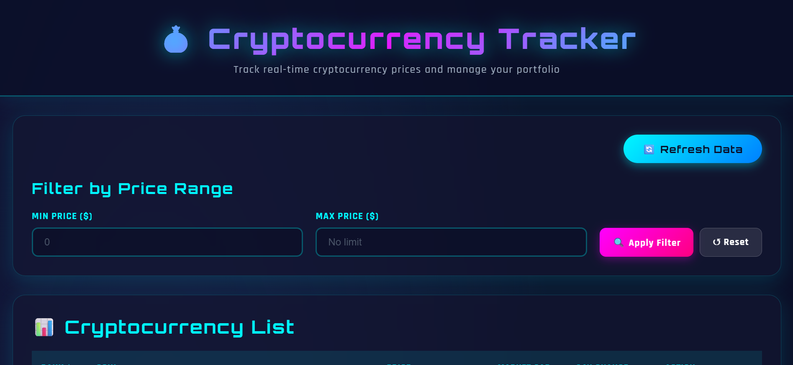
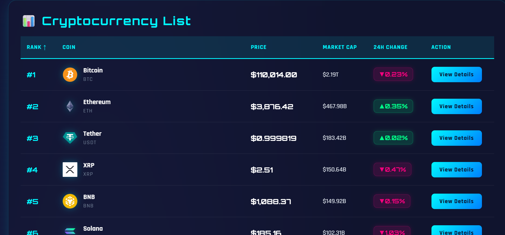
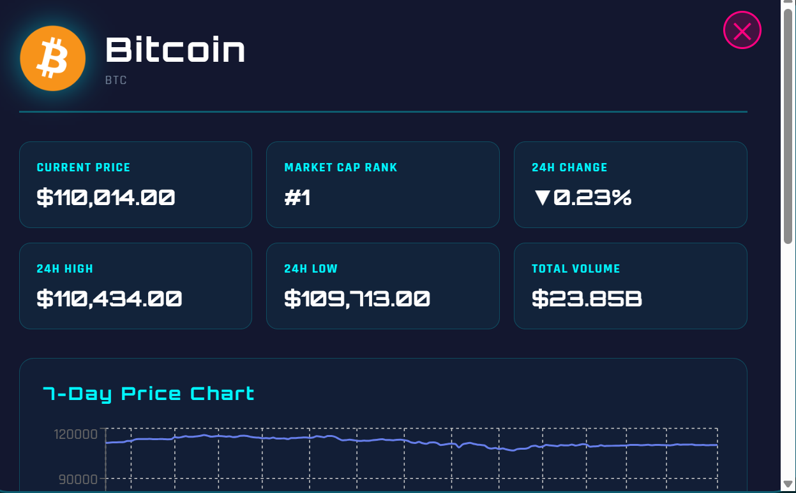
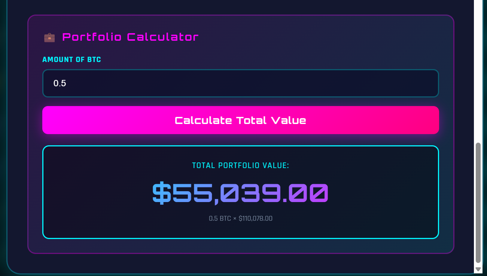
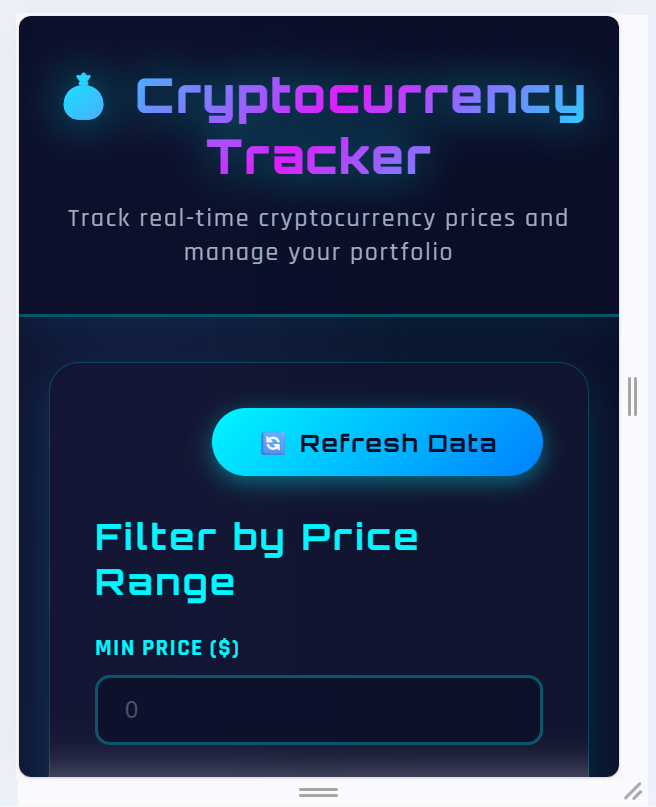

# 💰 Cryptocurrency Tracker

**Nama:** [HANIFAH HASANAH]  
**NIM:** 123140082  
**Mata Kuliah:** Pengembangan Aplikasi Web  
**Dosen:** [Muhammad Habib Algifari, S.Kom., M.TI.]  

---

## Deskripsi Project

Cryptocurrency Tracker adalah aplikasi web untuk tracking harga cryptocurrency secara real-time dengan fitur compare dan portfolio calculator. Aplikasi ini dibangun menggunakan ReactJS dan mengintegrasikan CoinGecko API untuk mendapatkan data cryptocurrency terkini.

---

## Fitur Utama

1. **Tabel List Cryptocurrency**
   - Menampilkan 100 cryptocurrency teratas
   - Informasi: Rank, Name, Price, Market Cap, 24h Change
   - Sortable columns (klik header untuk sort)

2. **Filter Berdasarkan Range Harga**
   - Input minimum dan maximum price
   - Filter real-time
   - Reset filter

3. **Detail Cryptocurrency dengan Chart**
   - Chart harga 7 hari terakhir
   - Menggunakan library Recharts
   - Interactive tooltip

4. **Portfolio Calculator**
   - Input jumlah coin yang dimiliki
   - Menampilkan total value dalam USD
   - Real-time calculation

5. **Refresh Data Button**
   - Update data terbaru dari API
   - Loading indicator

---

## Tech Stack

- **Framework:** ReactJS (Create React App)
- **Styling:** CSS3 (Pure CSS)
- **Chart Library:** Recharts
- **API:** CoinGecko API
- **Deployment:** Vercel
- **Version Control:** Git & GitHub

---

## Cara Instalasi

### Prerequisites
- Node.js (v14 atau lebih baru)
- npm atau yarn
- Git

### Langkah Instalasi

1. **Clone repository**
```bash
   git clone https://github.com/HANIFAHHASANAH-123140082/uts-pemweb-123140082.git
   cd uts-pemweb-123140082
```

2. **Install dependencies**
```bash
   npm install
```

3. **Jalankan aplikasi**
```bash
   npm start
```

4. **Buka browser**
```
   http://localhost:3000
```

---

## Link Deployment

🔗 **Live Demo:** [https://uts-pemweb-123140082.vercel.app/]

---

## Screenshot

### 1. Homepage


### 2. Cryptocurrency Table


### 3. Detail Modal with Chart


### 4. Portfolio Calculator


### 5. Mobile Responsive


---

## Struktur Project
```
uts-pemweb-123140082/
├── public/
│   └── index.html
├── src/
│   ├── components/
│   │   ├── Header.jsx
│   │   ├── SearchForm.jsx
│   │   ├── DataTable.jsx
│   │   └── DetailCard.jsx
│   ├── App.jsx
│   ├── App.css
│   └── index.js
├── screenshots/
│   ├── homepage.png
│   ├── table.png
│   ├── detail.png
│   ├── calculator.png
│   └── mobile.png
├── package.json
└── README.md
```

---

## Fitur yang Diimplementasikan

### CPMK0501: Tabel, Form, CSS (45%)
- ✅ Form dengan 2 input (min/max price) + validation HTML5
- ✅ Tabel data dinamis dengan 6 kolom dari API
- ✅ CSS dengan multiple selectors, pseudo-classes
- ✅ Responsive design dengan media queries
- ✅ Flexbox dan CSS Grid

### CPMK0502: HTML, JavaScript, ReactJS (55%)
- ✅ HTML5 structure dengan semantic tags
- ✅ Arrow functions, template literals, destructuring
- ✅ Async/await untuk API calls
- ✅ Array methods (map, filter, sort)
- ✅ Functional components React
- ✅ useState dan useEffect hooks
- ✅ Props passing antar component
- ✅ Conditional rendering
- ✅ Event handling
- ✅ 4+ components (Header, SearchForm, DataTable, DetailCard)
- ✅ Fetch data dari API dengan error handling

### BONUS: Deployment dan Documentation (10%)
- ✅ GitHub repository public
- ✅ Struktur folder terorganisir
- ✅ 10+ commits dengan message jelas
- ✅ README lengkap dengan dokumentasi
- ✅ Screenshot aplikasi
- ✅ Deploy ke Vercel berhasil

---

## Fitur Teknis

### Modern JavaScript
```javascript
// Arrow Functions
const fetchData = async () => { ... }

// Template Literals
`https://api.coingecko.com/api/v3/coins/${id}`

// Destructuring
const { name, current_price } = coin

// Spread Operator
const sorted = [...cryptocurrencies].sort()

// Array Methods
const filtered = data.filter(crypto => crypto.price > min)
```

### React Hooks
```javascript
// useState
const [data, setData] = useState([])

// useEffect
useEffect(() => {
  fetchData()
}, [dependency])
```

### API Integration
- Fetch dari CoinGecko API
- Loading state management
- Error handling dengan try-catch
- Data transformation

---

## Styling Features

- **Gradient Background:** Linear gradient untuk background
- **Box Shadow:** Depth dengan shadow effects
- **Hover Effects:** Interactive hover states
- **Transitions:** Smooth animations
- **Responsive Grid:** Auto-fit grid layout
- **Modal Overlay:** Full-screen modal dengan backdrop
- **Flexbox:** Modern layout system
- **Media Queries:** Breakpoints untuk mobile & tablet

---

## Responsive Design

Aplikasi fully responsive dengan breakpoints:
- Desktop: 1400px+
- Tablet: 768px - 1399px
- Mobile: < 768px

---

## Error Handling

- API request error handling
- Loading states
- Empty state handling
- Form validation
- Console error-free

---

## API Endpoints Used

1. **Get Market Data**
```
   GET /coins/markets?vs_currency=usd&order=market_cap_desc&per_page=100
```

2. **Get Chart Data**
```
   GET /coins/{id}/market_chart?vs_currency=usd&days=7
```

---

## Credits

- **API Provider:** [CoinGecko](https://www.coingecko.com/)
- **Chart Library:** [Recharts](https://recharts.org/)
- **Deployment:** [Vercel](https://vercel.com/)
- **Icons:** Unicode Emoji

---

## License

© 2025 - UTS Pengembangan Aplikasi Web

---

## Author

Dibuat oleh **[HANIFAH HASANAH]**  
NIM: 123140082  
INSTITUT TEKNOLOGI SUMATERA